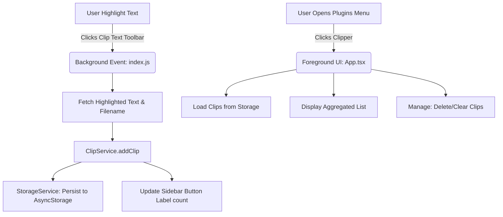

# Supernote Clipper Development Documentation

This is a living document outlining the design, architecture, technology stack, and engineering choices for the **Supernote Clipper** plugin.

---

## 1. Project Overview

**Supernote Clipper** is a React Native plugin designed for the Supernote Manta (E-ink) OS environment. It enables users to:
1. Highlight or select text inside EPUBs, PDFs, and text documents and clip them to a unified dashboard.
2. Aggregate multiple clippings sequentially.
3. Manage, delete, or clear clippings from a dedicated full-screen sidebar application.
4. Paste the aggregated block of text back into notes or digests.

---

## 2. Architecture & Logic Flow

The plugin operates in two contexts: **background selection handler** (text toolbar) and **foreground application** (sidebar menu).



### Key Components:

*   **`index.js` (Entry Point & Event Listener)**:
    *   Registers the text selection toolbar button (`id: 300`) and the plugins sidebar button (`id: 100`) synchronously on startup so the host OS registers them before script compilation completes.
    *   Listens to toolbar events: when `Clip Text` is pressed, it calls `PluginDocAPI.getLastSelectedText()` to capture the highlight and `PluginCommAPI.getCurrentFilePath()` to label it with the document source.
    *   Detects active file type context (Note vs. Document) on button press to enable context-aware sidebar features.
*   **`ClipService.ts` (State Manager)**:
    *   Cleans and processes clippings (joins hyphenated line-breaks, normalizes spaces).
    *   Saves clips list to AsyncStorage.
    *   Dynamically updates the sidebar menu button label (e.g., `Clipper (5)`) by calling `PluginManager.registerButton` with the updated count.
    *   Manages active file context (`isNoteFile`) state.
*   **`StorageService.ts` (Persistence)**:
    *   Manages saving/loading of JSON data objects and active file context using AsyncStorage.
*   **`App.tsx` (Dashboard UI)**:
    *   Rendered when the user clicks the `Clipper` icon in the sidebar/plugins menu.
    *   Lists all individual clippings with their source document name.
    *   Provides high-contrast buttons optimized for E-ink screens to copy the aggregate, clear all clips, or delete selected highlights.

### File Context Detection Logic

To optimize usability on the Supernote, the plugin dynamically detects the active editor context (Note vs. Document) to customize the dashboard:
1. When either button (`id: 100` or `id: 300`) is pressed, `index.js` queries `PluginCommAPI.getCurrentFilePath()`.
2. If the active path does not end with a known document format (PDF, EPUB, TXT, CBZ, FB2) or is empty/null, the system marks the context as a `.note` editor page via `ClipService.setActiveFileType(true)`.
3. In the foreground dashboard (`App.tsx`), this state determines whether the **Insert into Note** and **Insert Selected** buttons are rendered and active, as the text-box insertion API (`PluginNoteAPI.insertText`) is only compatible with Note files.

---

## 3. Technology Stack

*   **React Native**: `0.79.2` (runs inside Hermes JS engine).
*   **React**: `19.0.0`.
*   **Storage**: `@react-native-async-storage/async-storage` (`1.24.0`).
*   **Native Bridge SDK**: `sn-plugin-lib` (`^0.1.19`).
*   **Android Build Configuration**:
    *   **Kotlin**: `2.1.0`.
    *   **NDK Target**: `arm64-v8a` (optimized package excludes x86/32-bit binaries to minimize size).
    *   **Package Size**: Compressed from 113.46 MB to ~7.38 MB.

---

## 4. Key Design Decisions & Bug Resolutions

### 1. Database Compatibility (Room Exception Fix)
*   **Bug**: Using AsyncStorage `3.x` triggered `java.lang.AbstractMethodError` inside `RoomDatabase.createOpenHelper`. The Room library version bundled in the plugin clashed with the Room version pre-loaded on the device OS.
*   **Solution**: Downgraded AsyncStorage to `1.24.0`. This version uses native `SQLiteOpenHelper` directly, completely bypassing Room library conflicts.

### 2. Sidebar Button Timing Fix
*   **Bug**: The Clipper sidebar button would periodically fail to appear in the menu list.
*   **Solution**: Moved `PluginManager.registerButton(1, ...)` from the async storage resolution callback to a top-level synchronous call in `index.js`. The host OS now registers the menu button immediately, and the service updates its label asynchronously later.

### 3. E-Ink Contrast & Icon Optimization
*   **Bug**: Wireframe icons (magnifying glass and funnel) with thin lines or anti-aliased gray pixels appeared very faint or invisible on the e-ink screen.
*   **Solution**: Ran a Python dilation script to pre-process the PNG outlines by:
    1. Mapping anti-aliased gray pixels to solid opaque black.
    2. Expanding outlines by 25px to ensure thick, crisp, high-contrast black drawings on fully transparent backgrounds.
    3. Generating a custom high-contrast cross `clear.png` asset to replace raw text `[X]` symbols for clearing filters/searches.

### 4. Android Absolute Rendering & Backdrop Event Bubbling
*   **Bug 1**: Rendering the absolute popover container inside the main flex column collapsed the sibling `ScrollView` height to 0 on Android.
*   **Bug 2**: Tapping elements within the absolute popover bubbled through to the backdrop underneath, triggering backdrop closure instantly.
*   **Solution**: Rendered the absolute popover outside the main container as a direct child of `SafeAreaView`. Wrapped the popover elements in a dummy `<Pressable onPress={() => {}}>` to absorb all events and stop touch bubbling.

### 5. Font Scaling & Dynamic Height Optimization
*   **Bug**: Using fixed heights (e.g. `height: 44` or `height: 52`) with system font scaling caused text elements to truncate or clip vertically when scaled up.
*   **Solution**: Replaced hardcoded heights with `minHeight` (e.g., `minHeight: 48` for rows, `minHeight: 52` for buttons) and flexible padding so containers automatically expand vertically when accessibility scaling is enabled.

### 6. Subtitle-Row Integrated Active Chips
*   **Design Choice**: Rather than consuming vertical space above the scroll container, active search/filter chips are integrated into the header's subtitle row, right-aligned under the filter icon.
*   **Contrast**: Chips feature an inverted black background and white text/icons to make the active filtering state highly obvious on e-ink.
*   **Flex-Wrap**: Configured `headerSubtitleRow` with `flexWrap: 'wrap'` so that if a long document title or search string is filtered, the chips wrap cleanly to a new line on the right, dynamically expanding the header.

### 7. Chronological Timestamp Headers
*   **Design Choice**: Replaced the static index labels (`CLIP #N`) inside card headers with human-readable date-time strings (e.g., `June 14, 2026 12:42 PM`).
*   **Layout Protection**: Set `flexShrink: 1` on the timestamp container and reduced the source filename `maxWidth` to `45%` to prevent text collisions.

---

## 5. Development & Compilation Workflow

### Rebuilding the Plugin:
Run the script in the project directory:
```bash
./buildPlugin.sh
```

### Outputs:
The script creates:
1. `build/outputs/SnClipper.snplg` (The final plugin package).
2. `build/outputs/SnClipper.zip` (Intermediary zip package).

---

## 6. TODOs & Future Roadmap

- [x] **Search & Filter**: Add a search bar to filter clips by document name or content snippet in the sidebar dashboard (Completed: wireframe header triggers, inverted active chips, and local Sort & Filter popover).
- [ ] **Custom Separator Settings**: Allow users to configure separators between aggregated blocks (e.g., custom markers, double line-breaks, or horizontal rules).
- [ ] **Rich Formatting**: Export clippings as formatted Markdown quote blocks (`> text`) instead of raw unformatted strings.
